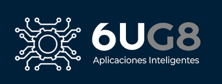

### # 6UG8 (Sexto Semestre Grupo 8)
# WEB APP

**UNIVERSIDAD REGIONAL AUTÓNOMA DE LOS ANDES 
“UNIANDES”**  
>FACULTAD DE SISTEMAS MERCANTILES  
CARRERA DE INGENIERÍA DE SOFTWARE  
SEXTO SEMESTRE  
MODALIDAD: ON LINE

## Integrantes
>Hugo Alfredo Herrera Villalva  
Jaime Santiago Borja Romero  
Jorge Luis López Romo  
Joel Darío Brito Parra  
Ricardo Josué Vaca Miño  

## Aplicacion Web 
## Lenguajes de programacion utilizados

## Lenguajes de marcado y estilo

